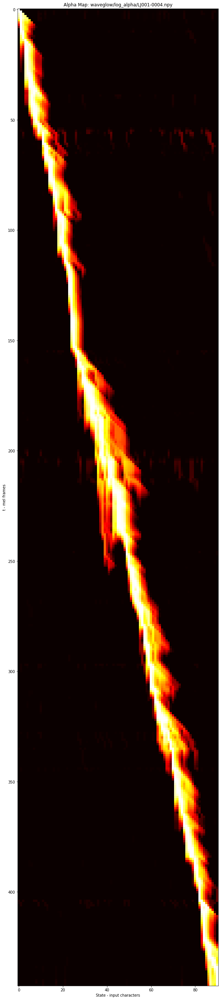
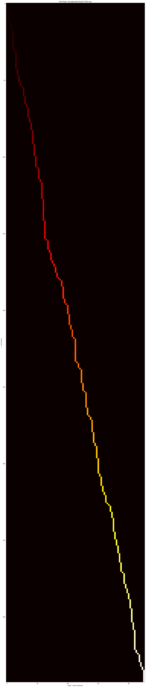

# aligntts
Implementation of ALIGNTTS: EFFICIENT FEED-FORWARD TEXT-TO-SPEECH SYSTEMWITHOUT EXPLICIT ALIGNMENT (arXiv:2003.01950v1  [eess.AS]  4 Mar 2020)

Aligntts [https://arxiv.org/abs/2003.01950] has improved upon original Microsoft's FastSpeech that it is self-contained. It contains duration predictor in the length regulator based on HMM. Mix Density Network produces multivariate gaussian mean and covariance. Spectorograms are observations and the problem to solve is to find the best gaussian parameters so joint probability of these observations are maximized in these gaussians. Adapted Baum-Welch algorithm is used to maximize joint probability from all gaussians and loss is minus log of last joint probability (pdf actually). Durations are extracted with some variation Viterbi algorithm which is not like is the book since it requires state (character in our case) transition probabilities which we do not have. Please see Pual Taylor book to learn more.
Training as explained in the article has four phases. First two are rough training to get Mix Density Network and encoder and decoder feed-forward transformer weights into reasonable values. Third phase train everything, encoder, decoder transformers, Mix Density Network at once. Only after this, in phase four, we train duration predictor. During inference, Mix Density Network is not used. I was able to avoid any loops in inference as well.
Generated mel samples and wav files produced by vocoder out of these mels are in samples directory.
Observations and issues:
- Mix Density Network does 64bit calculations. I beleive, it can be trained in 32bit only, but I had NaNs in back-propagation when I just started and could not find work around at that time
- I was planning originally to use TPU for training, but with 64bit, TPU does not work. I use TPUEstimator. It works with GPU and CPU just fine
- I used tf.math.softplus in the last dense layer of Mixed Density Network to help start training. Relu produces zeros at the begining of the training until network learn something. softplus seems help. I was not able to converge starting from first phase having all Relu activations in Mix Density Network 
Software I borrowed and credits:
- I used BERT transformer implementation from original BERT GitHub repository. I had no objective to rewrite transformers, duration predictor and Mix density network I saw as my primary challage and interest
- I use tensorflow implementation of nvidia waveglow by https://github.com/weixsong/WaveGlow. This is rewritten pytorch into tensorflow. To make sure that my mels are identical, I use audio routines from this implementation in particular audio_utils.py and params.py. This parames file from here should be used during waveglow training.
- I have not put complete thought on accepted alphabet of input. I think that semicolon, colon, comma, dash, question mark, exclamation mark are important to prosody features of the generated speech. Opposite, quotes, do not impact prosody and should be spelled as "quote unquote" if important. Non-english charactes are welcome if there are sufficient training samples of their occurence. I do not beleive that LJSpeech-1.1 has sufficient samples for non-english charactes.
- Training is four major step sequence. Each step covers only part of the network. I apply gradients only to specific variables. I do not use tensorflow network element parameters. Adam algorithm creates special adam related variables for its needs. In order to do multi-phase training like this, specific weigths are loaded at the begining of each phase. After this, in case of restart, it will continue training from the last checkpoint. I borrowed some of the elements of training setup from BERT. They use same technique to train models with specific tasks based on BERT generic training.
- Article is saying to use adaptive training rate in first two phases, I used 1e-6 and then used 5e-5, since 1e-6 takes forever 
Steps:
1. Before start:
- all training output and durations csv files will be in gcp. create gcp storage - speech_synthesis and subfolder aligntts
- mel files, npy files to draw duration diagrams are saved into local disk
- I generate training data into local folder - data. If TPU would be used then data should be in gcp storage as well
2. Data preparation:
- Download LJSpeech-1.1
- Prepare data, it will create three sets of mel files will be in data directory
`python prepare_data.py --metadata_file=LJSpeech-1.1/metadata.csv --tfrecords_file='data/{}.tfrecords' --audio_files=LJSpeech-1.1/wavs`
3. Train Mix Density Network and encoder feed-forward transformers on CPU. You can use GPU, did not work much faster for me
`python training.py --batch_size=16 --save_checkpoints_steps=500 --action=TRAIN --training_task=alignment_loss --clip_gradients=1.0 --learning_rate=5e-5 --train_file=data/train.tfrecords --keep_checkpoint_max=400 --output_dir='gs://speech_synthesis/aligntts/output/alignment_loss'`
4. Validate that you have network that produce durations that make sense and you can do the same in every phase to see that your network is still alright, but use correstonding network of each phase. It will output npy files
4.1 Create log_alpha and Viterbi data in .npy format
python training.py --batch_size=16 --action=PREDICT --prediction_task='alpha_values' --test_file=data/test.tfrecords --output_dir='gs://speech_synthesis/aligntts/output/alignment_loss'
4.2 Visualize log_alpha and Viterbi data with notebook.ipynb

5. Extract durations for all three tfrecord sets, get duration.csv from gcp using gsutil every time and combine them all into one file
`python training.py --batch_size=16 --action=PREDICT --prediction_task='duration_predictor' --test_file=data/train.tfrecords --output_dir='gs://speech_synthesis/aligntts/output/alignment_loss'
gsutil cp 'gs://speech_synthesis/aligntts/output/alignment_loss/durations.csv' train-durations.csv
python training.py --batch_size=16 --action=PREDICT --prediction_task='duration_predictor' --test_file=data/val.tfrecords --output_dir='gs://speech_synthesis/aligntts/output/alignment_loss'
gsutil cp 'gs://speech_synthesis/aligntts/output/alignment_loss/durations.csv' val-durations.csv
python training.py --batch_size=16 --action=PREDICT --prediction_task='duration_predictor' --test_file=data/test.tfrecords --output_dir='gs://speech_synthesis/aligntts/output/alignment_loss'
gsutil cp 'gs://speech_synthesis/aligntts/output/alignment_loss/durations.csv' test-durations.csv
cat train-durations.csv val-durations.csv test-durations.csv > durations.csv`
6. Regenerate training datasets with durations created in the previous step. This time training data will have durations in it
`python prepare_data.py --metadata_file=LJSpeech-1.1/metadata.csv --tfrecords_file='data/{}.tfrecords' --audio_files=LJSpeech-1.1/wavs --durations_file=durations.csv`
7. Train both encoder and decoder parts where length regulator is using durations from the training data. Specify last or best specific checkpoint from alignment_loss training step.
`python training.py --batch_size=16 --save_checkpoints_steps=500 --action=TRAIN --training_task=fixed_encoder --clip_gradients=1.0 --learning_rate=5e-5 --train_file=data/train.tfrecords --keep_checkpoint_max=400 --output_dir='gs://speech_synthesis/aligntts/output/fixed_encoder' --init_checkpoint='gs://speech_synthesis/aligntts/output/alignment_loss/model.ckpt-133600'`
8. Train all network when durations are generated on the fly by mixed density network. 80k steps seems OK, but I did duration transformer and decoder transformers without masks first and added them later, so I had to extent training to see the difference. These masks did not improve anything. I always had encode sentence length mask. Also, use whatever you have latest checkpoint from phase two
`python training.py --batch_size=12 --save_checkpoints_steps=500 --action=TRAIN --training_task='joint_fft_mix_density' --clip_gradients=1.0 --learning_rate=1e-4 --train_file=data/train.tfrecords --keep_checkpoint_max=400 --output_dir='gs://speech_synthesis/aligntts/output/joint_fft_mix_density' --init_checkpoint='gs://speech_synthesis/aligntts/output/fixed_encoder/model.ckpt-40000'`
9. Extract durations for all three tfrecord sets, get duration.csv from gcp using gsutil every time and combine them all into one file
`python training.py --batch_size=16 --action=PREDICT --prediction_task='duration_predictor' --test_file=data/train.tfrecords --output_dir='gs://speech_synthesis/aligntts/output/joint_fft_mix_density'
gsutil cp 'gs://speech_synthesis/aligntts/output/joint_fft_mix_density/durations.csv' train-durations.csv
python training.py --batch_size=16 --action=PREDICT --prediction_task='duration_predictor' --test_file=data/val.tfrecords --output_dir='gs://speech_synthesis/aligntts/output/joint_fft_mix_density'
gsutil cp 'gs://speech_synthesis/aligntts/output/joint_fft_mix_density/durations.csv' val-durations.csv
python training.py --batch_size=16 --action=PREDICT --prediction_task='duration_predictor' --test_file=data/test.tfrecords --output_dir='gs://speech_synthesis/aligntts/output/joint_fft_mix_density'
gsutil cp 'gs://speech_synthesis/aligntts/output/joint_fft_mix_density/durations.csv' test-durations.csv
cat train-durations.csv val-durations.csv test-durations.csv > durations.csv`
10. Regenerate training datasets with durations created in the previous step. This time training data will have durations in it
`python prepare_data.py --metadata_file=LJSpeech-1.1/metadata.csv --tfrecords_file='data/{}.tfrecords' --audio_files=LJSpeech-1.1/wavs --durations_file=durations.csv`
11. Train duration predictor using new training dataset with updated durations. Article says 10k, I used 10k-30k at different times. From observations, if duration is wrong, wave will omit sound or make sound longer and it will be notisable
`python training.py --batch_size=16 --save_checkpoints_steps=500 --action=TRAIN --training_task=duration_predictor --clip_gradients=1.0 --learning_rate=1e-4 --train_file=data/train.tfrecords --keep_checkpoint_max=400 --output_dir='gs://speech_synthesis/aligntts/output/duration_predictor' --init_checkpoint='gs://speech_synthesis/aligntts/output/joint_fft_mix_density/model.ckpt-131200'`
12. Infer to create mels using test tfrecords. You will have mel files created and they will be inputs for vocoder. See mel samples in samples/mel folder
`python training.py --batch_size=16 --action=PREDICT --test_file=data/test.tfrecords --output_dir='gs://speech_synthesis/aligntts/output/duration_predictor'`
13. Train vocoder implementation by https://github.com/weixsong/WaveGlow. Looking at the samples, the best quality is achived with lc_conv1d=False, lc_encode=True , transposed_upsampling=True. These are in params.py file and all other audio parameters. Train this with 350k-800k steps. Test the sound quality on the way
13.1 Preprocess data. Vocoder creates mels in a folder, in aligntts, mels are put into tfrecords file. But mels themselves are identical, params.py is the same
`python preprocess_data.py --wave_dir=LJSpeech-1.1/wavs --mel_dir=preprocess_output/mels --data_dir=preprocess_output`
13.2 Train vocoder
`python train.py --filelist=preprocess_output/train.scp --wave_dir=LJSpeech-1.1/wavs --lc_dir=preprocess_output/mels --restore_from=logdir/waveglow/`
13.3 infer wavs to see how vocoder works, use you latest checkpoint. It creates waveglow.wav in the current directory, play it and see how it sounds
`python inference.py --lc=preprocess_output/mels/LJ001-0001.mel --restore_from=logdir/waveglow/model.ckpt-512000`
14. Produce wav files from your aligntts output mels. Use bash for loop to loop through many files. replace LJ999-9999.mel with actual files names. See samples in samples/wav 
`python inference.py --lc=LJ999-9999.mel --restore_from=logdir/waveglow/model.ckpt-512000 --wave_name=name_you_want.wav`
